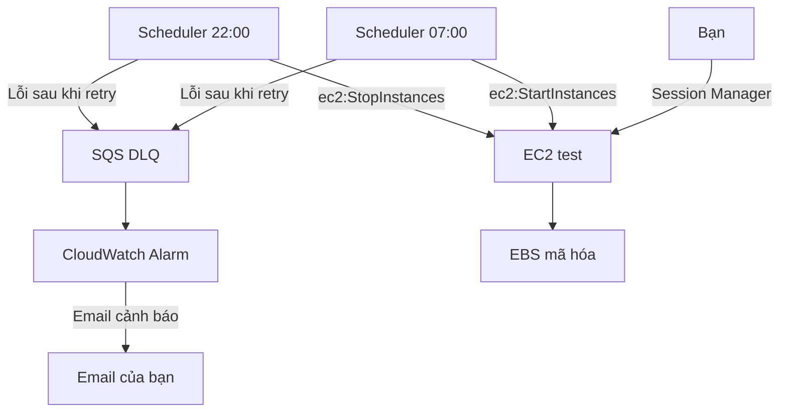

# Hướng dẫn triển khai EC2 test tự bật lúc 07:00 và tự tắt lúc 22:00

> Runbook từng bước dành cho một máy chủ test trên AWS, sử dụng giờ Việt Nam (`Asia/Ho_Chi_Minh`).

## 1. Mục tiêu và phạm vi

Sau khi hoàn thành tài liệu này, hệ thống sẽ có:

- Một máy ảo Amazon EC2 chạy Linux.
- Ổ đĩa EBS được mã hóa để dữ liệu vẫn còn sau khi dừng máy.
- Đăng nhập quản trị bằng AWS Systems Manager Session Manager, không cần mở cổng SSH `22`.
- Ứng dụng Node.js/NestJS tự chạy lại sau khi EC2 khởi động.
- EventBridge Scheduler tự gọi API:
  - `StartInstances` lúc **07:00 hằng ngày**.
  - `StopInstances` lúc **22:00 hằng ngày**.
- IAM role theo nguyên tắc quyền tối thiểu: mỗi lịch chỉ được thao tác trên đúng một EC2.
- Retry, SQS dead-letter queue và CloudWatch alarm để phát hiện lịch chạy lỗi.
- AWS Budget để cảnh báo chi phí.

Tài liệu giả định:

- Đây là môi trường **test**, không phải production.
- Bạn triển khai một EC2 độc lập, không thuộc Auto Scaling Group.
- Region được chọn là **Asia Pacific (Singapore) — `ap-southeast-1`**.
- Hệ điều hành là **Amazon Linux 2023**.
- Lịch chạy cả thứ Bảy và Chủ nhật.

Nếu dùng Region khác, phải thay `ap-southeast-1` trong toàn bộ ARN và chọn đúng Region trên AWS Console.

## 2. Kiến trúc sau khi hoàn thành



EventBridge Scheduler chạy bên ngoài EC2. Vì vậy, lịch 07:00 vẫn có thể bật EC2 khi máy đang tắt. Nếu đặt cron bên trong Linux, cron cũng tắt theo máy và không thể tự bật lại máy.

Thiết kế này gọi thẳng EC2 API nên không cần Lambda. Lambda chỉ cần thiết khi có logic phức tạp như chọn instance theo tag, kiểm tra ngày nghỉ hoặc kiểm tra điều kiện trước khi dừng.

Tài liệu AWS:

- [EventBridge Scheduler universal targets](https://docs.aws.amazon.com/scheduler/latest/UserGuide/managing-targets-universal.html)
- [Cron, múi giờ và độ chính xác của Scheduler](https://docs.aws.amazon.com/scheduler/latest/UserGuide/schedule-types.html)
- [Cơ chế Stop/Start của EC2](https://docs.aws.amazon.com/AWSEC2/latest/UserGuide/Stop_Start.html)

## 3. Hiểu đúng về lịch và chi phí

Mỗi ngày EC2 dự kiến chạy từ 07:00 đến 22:00, tức 15 giờ, và dừng 9 giờ.

Điều này giảm khoảng:

```text
9 / 24 × 100 = 37,5% thời gian compute
```

Đây không phải mức giảm 37,5% toàn bộ hóa đơn. Khi EC2 dừng:

- Phần compute On-Demand của EC2 ngừng tính theo thời gian chạy.
- EBS vẫn được tính phí vì dữ liệu vẫn được lưu.
- Snapshot, Elastic IP/public IPv4, Route 53 và các dịch vụ khác vẫn có thể tính phí.
- Stop khác Terminate. **Stop giữ instance; Terminate xóa instance.**

Khi Scheduler chạy lúc 07:00, API được gọi trong khoảng `07:00:00–07:00:59`. EC2, hệ điều hành và ứng dụng còn cần thêm thời gian khởi động. Nếu ứng dụng phải sẵn sàng đúng 07:00, hãy đo thời gian boot rồi đổi lịch thành 06:55 hoặc sớm hơn.

## 4. Quy ước tên và thông tin cần ghi lại

Tạo một file ghi chú riêng, không commit secret vào Git. Điền các giá trị sau trong quá trình làm:

| Biến | Ví dụ | Lấy ở đâu |
| --- | --- | --- |
| `AWS_ACCOUNT_ID` | `123456789012` | Menu tài khoản ở góc phải AWS Console |
| `AWS_REGION` | `ap-southeast-1` | Region selector |
| `INSTANCE_ID` | `i-0123456789abcdef0` | EC2 → Instances |
| `INSTANCE_ARN` | `arn:aws:ec2:ap-southeast-1:123456789012:instance/i-...` | Tự ghép theo mẫu |
| `SCHEDULE_GROUP` | `test-server-power-management` | Tạo ở bước Scheduler |
| `DLQ_ARN` | `arn:aws:sqs:ap-southeast-1:123456789012:test-server-scheduler-dlq` | SQS queue details |
| `EMAIL` | `you@example.com` | Email nhận cảnh báo |

Không chép access key, secret access key, mật khẩu database hoặc token vào README, Git repository hay EC2 user data.

## 5. Bước 0 — Tạo và bảo vệ tài khoản AWS

Nếu đã có tài khoản AWS được bảo vệ bằng MFA và đang đăng nhập qua tài khoản quản trị riêng, chuyển đến Bước 1.

### 5.1 Tạo tài khoản AWS

Mở [AWS account signup](https://signin.aws.amazon.com/signup) và hoàn tất đăng ký.

### 5.2 Bật MFA cho root user

1. Đăng nhập AWS Console bằng root user.
2. Mở menu tài khoản → **Security credentials**.
3. Tại **Multi-factor authentication (MFA)**, chọn **Assign MFA device**.
4. Dùng ứng dụng xác thực hoặc security key.
5. Lưu recovery information ở nơi an toàn.

**Kỹ thuật đang thực hiện:** MFA thêm yếu tố xác thực thứ hai. Nếu mật khẩu bị lộ, kẻ tấn công vẫn thiếu mã hoặc thiết bị MFA. Root user có toàn quyền trên tài khoản nên chỉ dùng cho các việc bắt buộc ở cấp tài khoản.

Tài liệu: [AWS root user best practices](https://docs.aws.amazon.com/IAM/latest/UserGuide/root-user-best-practices.html)

### 5.3 Tạo danh tính quản trị sử dụng hằng ngày

AWS khuyến nghị dùng quyền truy cập tạm thời qua IAM Identity Center thay cho access key dài hạn.

1. Mở [IAM Identity Center Console](https://console.aws.amazon.com/singlesignon/home).
2. Chọn **Enable** nếu dịch vụ chưa được bật.
3. Tạo user cho chính bạn.
4. Tạo permission set quản trị trong giai đoạn bootstrap.
5. Gán user vào AWS account.
6. Đăng xuất root và đăng nhập qua AWS access portal.

**Kỹ thuật đang thực hiện:** IAM Identity Center phát session credential có thời hạn. Credential tạm thời giảm rủi ro so với access key tồn tại lâu. Khi hệ thống ổn định, có thể giảm quyền của tài khoản làm việc theo nhiệm vụ thực tế.

Tài liệu: [Getting started with IAM Identity Center](https://docs.aws.amazon.com/singlesignon/latest/userguide/getting-started.html)

## 6. Bước 1 — Chọn Region cố định

1. Trên thanh trên cùng AWS Console, mở Region selector.
2. Chọn **Asia Pacific (Singapore) — `ap-southeast-1`**.
3. Giữ nguyên Region này trong EC2, SQS, EventBridge Scheduler và CloudWatch.

**Kỹ thuật đang thực hiện:** phần lớn tài nguyên AWS thuộc một Region. EC2 ở Singapore không xuất hiện trong danh sách EC2 của Tokyo. Scheduler và target nên cùng Region để cấu hình, IAM ARN và vận hành dễ kiểm soát.

## 7. Bước 2 — Tạo cảnh báo chi phí trước khi tạo server

1. Mở [AWS Billing and Cost Management](https://console.aws.amazon.com/billing/home).
2. Vào **Budgets** → **Create budget**.
3. Chọn **Cost budget**.
4. Chọn chu kỳ **Monthly**.
5. Đặt ngân sách phù hợp, ví dụ `10 USD` hoặc `20 USD`.
6. Tạo cảnh báo tại:
   - 50% actual cost.
   - 80% actual cost.
   - 100% forecasted cost.
7. Nhập email và xác nhận nếu AWS yêu cầu.

**Kỹ thuật đang thực hiện:** Budget theo dõi chi phí đã phát sinh và dự báo. Nó gửi cảnh báo, nhưng mặc định không phải giới hạn cứng và không tự tắt tài nguyên. Cảnh báo sớm giúp phát hiện instance chọn nhầm kích thước, volume/snapshot bị bỏ quên hoặc tài nguyên khác vẫn chạy.

Tài liệu: [Managing costs with AWS Budgets](https://docs.aws.amazon.com/cost-management/latest/userguide/budgets-managing-costs.html)

## 8. Bước 3 — Tạo IAM role cho EC2 dùng Session Manager

1. Mở [IAM Console](https://console.aws.amazon.com/iam/).
2. Chọn **Roles** → **Create role**.
3. Trusted entity type: **AWS service**.
4. Use case: **EC2**.
5. Gắn managed policy `AmazonSSMManagedInstanceCore`.
6. Đặt tên role: `test-ec2-ssm-role`.
7. Tạo role.

AWS sẽ tạo hoặc sử dụng instance profile để gắn role vào EC2.

**Kỹ thuật đang thực hiện:** EC2 lấy temporary credential từ instance profile và dùng nó để giao tiếp với Systems Manager. Không cần đặt AWS access key trên máy. Policy này được gắn cho **máy EC2**, không phải cho người đăng nhập.

Tài liệu:

- [Session Manager prerequisites](https://docs.aws.amazon.com/systems-manager/latest/userguide/session-manager-prerequisites.html)
- [Configure instance permissions for Session Manager](https://docs.aws.amazon.com/systems-manager/latest/userguide/session-manager-getting-started-instance-profile.html)

## 9. Bước 4 — Tạo Security Group

1. Mở [EC2 Console](https://console.aws.amazon.com/ec2/).
2. Vào **Security Groups**.
3. Chọn **Create security group**.
4. Name: `test-app-sg`.
5. Chọn default VPC trong lần thử đầu tiên.
6. **Inbound rules:** để trống ở thời điểm này. (Kiểm soát kết nối từ máy cá nhân đi vào EC2)
7. **Outbound rules:** giữ outbound cho phép HTTPS/internet để SSM Agent và package manager hoạt động. (Kiểm soát kết nối từ EC2 đi ra ngoài, chẳng hạn tải package hoặc kết nối AWS Services/database)
8. Bấm **Create security group**.

> Không mở inbound port `22`. Session Manager thiết lập kết nối quản trị qua HTTPS outbound nên không cần SSH từ Internet.

<u>***Khi cần truy cập ứng dụng từ máy cá nhân, thêm rule giới hạn nguồn:***</u>

| Type | Port | Source | Khi nào dùng |
| --- | ---: | --- | --- |
| HTTP | 80 | `My IP` | Nếu Nginx reverse proxy ứng dụng |
| Custom TCP | 3000 | `My IP` | Test trực tiếp NestJS, chỉ dùng tạm thời |
| HTTPS | 443 | `My IP` hoặc phạm vi cần thiết | Khi đã cấu hình TLS |

**Kỹ thuật đang thực hiện:** Security Group là stateful firewall gắn với network interface. Inbound trống ngăn kết nối mới từ Internet vào máy; outbound cho phép máy chủ chủ động kết nối tới endpoint AWS và kho package. Rule `My IP` tạo CIDR `/32`, chỉ cho IP công cộng hiện tại của bạn truy cập.

Tài liệu: [Security group rules](https://docs.aws.amazon.com/AWSEC2/latest/UserGuide/security-group-rules.html)

## 10. Bước 5 — Tạo EC2 instance

1. Trong [EC2 Console](https://console.aws.amazon.com/ec2/), chọn **Instances → Launch instances**.
2. Name: `test-app-server`.
3. AMI: **Amazon Linux 2023**.
4. Architecture: `64-bit (x86)`.
5. Instance type: bắt đầu với `t3.micro` nếu phù hợp tải test. Kiểm tra giá và điều kiện Free Tier hiện tại trước khi chọn.
6. Key pair: nếu chỉ dùng Session Manager, chọn **Proceed without a key pair**.
7. Network:
   - Chọn default VPC.
   - Chọn public subnet.
   - Auto-assign public IP: **Enable** cho lần thử đầu tiên để máy có outbound Internet.
   - Chọn **Select existing security group** `test-app-sg`.
8. Storage (Đây là phần cấu hình ổ cứng của EC2, cụ thể là một EBS root volume chứa hệ điều hành, source code, package, log và những dữ liệu bạn lưu trên máy):
   - > **`Storage type: EBS`** 
      1) ***Ý nghĩa***: **`EBS`** là viết tắt của Elastic Block Store. Đây là ổ đĩa mạng được **`AWS`** gắn vào **`EC2`**. 
      <u>***Trong đó:***</u>
      **`EC2`** = máy tính, **`EBS`** = ổ SSD gắn với máy tính đó
      2) ***Điểm quan trọng của EBS:***
        - Reboot EC2: dữ liệu vẫn còn.
        - Stop rồi Start EC2: dữ liệu vẫn còn.
        - EC2 chuyển sang máy vật lý khác: EBS vẫn được gắn lại.
        - Terminate EC2: dữ liệu có thể bị xóa, phụ thuộc vào Delete on termination.
        **Kết luận:** EBS phù hợp cho root volume vì dữ liệu tồn tại độc lập với vòng đời chạy/dừng của máy. AWS cũng sao chép dữ liệu EBS trên nhiều thiết bị trong cùng Availability Zone để giảm nguy cơ mất dữ liệu do một thiết bị vật lý hỏng
   - > **`Snapshot: snap-003402e1dadb01c43`**
      1) ***Ý nghĩa***: **`snap-003402e1dadb01c43`** là bản chụp dữ liệu của một **`EBS volume`** tại một thời điểm. Ở đây, snapshot này là nguồn để AWS tạo root volume cho EC2. 
      > Flow như sau: Amazon Linux AMI -> EBS snapshot -> Root volume 16 GiB -> EC2 khởi động

      **`Notes:`** Bạn không cần thay đổi thông số này. Nó tự động đi theo AMI.
      ***Snapshot EBS*** là dạng backup theo thời điểm và các snapshot tiếp theo có tính chất incremental: chỉ lưu thêm những block đã thay đổi. Tuy nhiên, AWS không tự động backup dữ liệu ứng dụng của bạn chỉ vì volume được tạo từ snapshot; muốn backup dữ liệu sau này, bạn vẫn phải tạo snapshot riêng hoặc dùng AWS Backup
   - > **`Volume type: gp3`**
      1) **`Ý nghĩa:`** là loại General Purpose SSD thế hệ hiện tại của EBS
        - Nó phù hợp cho:
          - **`Root volume.`**
          - **`Web server.`**
          - **`API Node.js/NestJS.`**
          - **`Môi trường development và test.`**
          - **`Database tải nhỏ hoặc vừa.`**
          - **`Các workload thông thường.`**
        **`Ưu điểm quan trọng của gp3`** là dung lượng, IOPS và throughput có thể cấu hình tương đối độc lập. Mức cơ bản này đã nằm trong chi phí lưu trữ gp3. Chỉ khi tăng vượt mức cơ bản mới có thêm phí hiệu năng. AWS khuyến nghị dòng General Purpose SSD cho phần lớn workload thông thường
   - > **`IOPS: 3000`**
      1) ***Ý nghĩa***: **`IOPS`** là viết tắt của Input/Output Operations Per Second, tức số thao tác đọc hoặc ghi mà volume có thể xử lý mỗi giây
        **Trong đó một thao tác I/O có thể là:**
        - **`Đọc một block dữ liệu.`**
        - **`Ghi một block dữ liệu.`**
        - **`Database đọc một record.`**
        - **`Node.js đọc nhiều file nhỏ.`**
        - **`Hệ điều hành tải các thư viện.`**
        - **`npm xử lý rất nhiều file nhỏ trong node_modules.`**
      - **`Trong đó:`** 3000 IOPS nghĩa là volume được provision để xử lý tối đa khoảng 3.000 thao tác I/O mỗi giây, còn hiệu năng thực tế phụ thuộc vào
        - **`Loại request đọc/ghi.`**
        - **`Kích thước mỗi request.`**
        - **`Instance type.`**
        - **`Giới hạn EBS bandwidth của EC2.`**
        - **`Khả năng tạo I/O của ứng dụng.`**
      > Lưu ý: Tăng IOPS chỉ hợp lý khi CloudWatch cho thấy storage thực sự là điểm nghẽn. Tăng trước khi đo chỉ làm phát sinh thêm chi phí.
   - > **`Throughput: 125`**
      1) ***Ý nghĩa***: **`Throughput`** là tổng lượng dữ liệu volume có thể truyền trong một giây.
      **Throughput quan trọng với các thao tác dữ liệu lớn và liên tục, ví dụ:**
      - **Đọc file dung lượng lớn.**
      - **Backup hoặc restore.**
      - **Copy Docker image.**
      - **Xử lý video.**
      - **Đọc log hoặc dataset lớn.**
      - **Sequential read/write.**
      > **IOPS và Throughput khác nhau thế nào?**
      Hình dung kho hàng:
      > + **`IOPS`** = mỗi giây xử lý được bao nhiêu kiện hàng.
      > + **`Throughput`** = mỗi giây vận chuyển được tổng cộng bao nhiêu kilogram.
      <u>**Ví dụ:**</u>
      > + **3000 file rất nhỏ cần nhiều IOPS.**
      > + **Một file 2 GB cần nhiều throughput.**
      > Lưu ý: Một volume có thể chạm giới hạn IOPS trước hoặc chạm giới hạn throughput trước, tùy workload.
   - > **`Delete on termination: Yes`**
      1) ***Ý nghĩa***: **`Delete on termination`** Nó quyết định chuyện gì xảy ra với volume khi bạn Terminate EC2
   - Dung lượng: khoảng **`8–16 GiB`** tùy ứng dụng
   - > **`Encrypted: Encrypted`**
      1) **`Ý nghĩa`** khuyên bật vì volume này có thể chứa:
        - **`Source code`**
        - **`File .env`**
        - **`Database credentials`**
        - **`Access token`**
        - **`Log request`**
        - **`Dữ liệu người dùng`**
        - **`File cấu hình hệ thống`**
          > <u>Khi bật EBS encryption, AWS mã hóa:</u>
          > - **Dữ liệu nằm trên volume**
          > - **Dữ liệu truyền giữa EC2 và EBS**
          > - **Snapshot được tạo từ volume**
          > - **Volume được khôi phục từ snapshot đã mã hóa**
          > **`Kết luận:`** AWS thực hiện việc mã hóa trên hạ tầng lưu trữ/host EC2 và quản lý khóa thông qua AWS KMS, AWS EBS encryption
          > **`Luồng có thể hiểu như sau:`** 
              > 1) Ứng dụng ghi dữ liệu -> Hạ tầng AWS mã hóa -> Dữ liệu mã hóa được lưu trên EBS
              > 2) Ứng dụng đọc dữ liệu -> Dữ liệu mã hóa trên EBS -> Hạ tầng AWS giải mã cho EC2 được cấp quyền -> Ứng dụng nhận dữ liệu

      > ***Quan trọng: Tại sao nên bật ngay từ đầu?***
      > ***Một volume đang không mã hóa không thể được chuyển trực tiếp thành encrypted bằng cách bấm một nút. Thông thường phải:***
      > - 1) Tạo snapshot.
      > - 2) Copy snapshot và bật encryption.
      > - 3) Tạo volume mới từ snapshot đã mã hóa.
      > - 4) Thay volume.
      > => Bật từ lúc tạo máy tránh quy trình chuyển đổi này về sau.
      
      > **`Encryption không bảo vệ được trường hợp nào?`**
      > **EBS encryption bảo vệ dữ liệu ở tầng storage. Nó không bảo vệ bạn nếu:**
      > - 1) Tài khoản AWS bị chiếm quyền.
      > - 2) Attacker đăng nhập được vào hệ điều hành.
      > - 3) Ứng dụng làm lộ dữ liệu qua API.
      > - 4) Secret được commit lên GitHub.
      > - 5) IAM permission cấp quá rộng.
      > - 6) Bạn vô tình xóa volume mà không có backup.
      > => Vì EC2 hợp lệ được phép sử dụng volume, hệ điều hành vẫn nhìn thấy dữ liệu đã giải mã bình thường.

    
   - > **`KMS key: Select`**
      1) **`Ý nghĩa: `** KMS key là khóa được AWS Key Management Service dùng để bảo vệ khóa mã hóa dữ liệu của volume.
        > **Bạn có hai lựa chọn chính:**
        > - 1) **AWS managed key** AWS tạo và quản lý key này cho dịch vụ EBS. Phù hợp với bạn lúc này vì:
            - Không cần tự quản lý key policy.
            - AWS tự xoay vòng key.
            - Không có phí duy trì hằng tháng cho AWS managed key.
            - Đủ tốt cho server test cá nhân.
          **Lưu ý:** Nếu giao diện cho phép để trống và tự dùng default EBS key, bạn có thể để trống. Nếu bắt buộc chọn, chọn key mặc định dạng aws/ebs
        > - 2) **Customer managed key** Đây là key bạn tự tạo trong KMS. Nó phù hợp khi cần:
            - Tự kiểm soát key policy.
            - Audit chi tiết việc sử dụng key.
            - Chia sẻ snapshot theo yêu cầu cụ thể.
            - Tách key theo môi trường hoặc dự án.
            - Chủ động disable hoặc rotate theo chính sách công ty.
                <u>+ **Nhưng nó tạo thêm:**</u>
                  - Phí KMS.
                  - IAM/KMS policy phải quản lý.
                  - Rủi ro tự khóa mình khỏi dữ liệu.
                  - Nếu key bị disable hoặc lên lịch xóa, volume có thể không sử dụng được.
                  - Với môi trường test hiện tại, chưa cần customer managed key. AWS cũng xem AWS managed key là lựa chọn hợp lý khi không có yêu cầu tự kiểm soát vòng đời và policy của key.
   - **`Volume initialization rate: optional`**
     1) **`Ý nghĩa: `** Volume của bạn được tạo từ snapshot AMI. Dữ liệu trong snapshot cần được tải và ghi vào EBS volume khi các block được sử dụng. Quá trình đó gọi là volume initialization.Nếu để trống:
        - AWS sử dụng tốc độ initialization mặc định.
        - Không mua thêm tốc độ initialization cố định.
        - Có thể có độ trễ cao hơn trong lần đầu đọc một số block.
        - Phù hợp với một server test nhỏ.
      2) **Nếu nhập từ 100–300 MiB/s:**
        - AWS tải block từ snapshot ở tốc độ được provision.
        - Thời gian hoàn tất initialization dễ dự đoán hơn.
        - Có phí bổ sung.
        - Hữu ích khi tạo nhiều volume lớn và cần đạt hiệu năng đầy đủ trong thời gian xác định.

   - Giữ `Delete on termination` nếu đây là test có thể dựng lại; snapshot trước khi terminate nếu cần giữ dữ liệu.
   
   **`Size ảnh hưởng chi phí thế nào?`** **`EBS`** tính phí dựa trên dung lượng đã provision, không dựa hoàn toàn vào dung lượng bạn đã sử dụng
   **Ví dụ:**
   - **Volume được tạo:** 16 GiB
   - **Dữ liệu thực tế:** 5 GiB
   - **Bạn vẫn trả phí cho volume 16 GiB**
9. **`File systems`** hỏi bạn có muốn gắn thêm một hệ thống lưu trữ bên ngoài vào EC2 hay không ?

  <span>- 1) Khi chọn <b style="font-size: 16px; text-decoration: underline;">None</b> AWS chỉ tạo **`EC2`**  với **`EBS root volume`** mà bạn đã cấu hình</span>
  ```js
  /
  ├── home
  ├── opt
  ├── var
  └── usr
  ```
  <p style="background: yellow"><b style="color: red; font-size: 20px;">+ Lưu ý quan trọng: Khi nào None không còn đủ?</b></p>
  <ul>
    <li>Có nhiều EC2 chạy đồng thời</li>
    <li>Nhiều EC2 phải dùng chung file upload</li>
    <li>Muốn file tồn tại ngay cả khi terminate EC2</li>
    <li>Lưu lượng file upload rất lớn</li>
    <li>Cần tách dữ liệu khỏi vòng đời server</li>
    <li>Cần storage chuyên dụng cho Windows hoặc HPC</li>
  </ul>

  <hr/>

  <span>- 2) Khi chọn <b style="font-size: 16px; text-decoration: underline;">S3 Files - new</b> thì lựa chọn này sử dụng <b>Mountpoint for Amazon S3</b> để hiển thị một S3 bucket dưới dạng thư mục trên Linux</span>
  <span> Ở phía sau, Mountpoint chuyển thao tác file thành S3 API:</span>
  ```js
    1) Ứng dụng đọc /mnt/s3/example.json
    2) Mountpoint chuyển thành S3 GetObject
    3) Amazon S3 trả object về
  ```

  <p style="background: yellow"><b style="color: red; font-size: 20px;">+ Lưu ý quan trọng: Nó phù hợp với trường hợp nào?</b></p>
  <ul>
    <li>Dataset machine learning lớn</li>
    <li>Data lake</li>
    <li>File ảnh/video lớn cần đọc từ S3</li>
    <li>ETL hoặc batch processing</li>
    <li>Nhiều máy cần đọc cùng một tập object</li>
    <li>Ứng dụng cũ yêu cầu đường dẫn file nhưng dữ liệu nằm trong S3</li>
  </ul>

  <p style="background: yellow"><b style="color: red; font-size: 20px;">+ Lưu ý quan trọng: Nó không hoàn toàn giống ổ đĩa Linux. AWS nêu rõ Mountpoint hỗ trợ các thao tác file cơ bản nhưng có giới hạn:</b></p>
  <ul>
    <li>Có thể đọc và liệt kê object</li>
    <li>Có thể tạo object mới</li>
    <li>Không sửa trực tiếp nội dung object hiện có theo cách file system thông thường</li>
    <li>Không hỗ trợ symbolic link</li>
    <li>Không hỗ trợ file locking</li>
    <li>Không xóa directory theo cách file system thông thường</li>
  </ul>
  <p style="background: yellow"><b style="color: red; font-size: 20px;">+ Vì vậy, không nên dùng nó để đặt:</b></p>
  <ul>
    <li>node_modules</li>
    <li>MongoDB data</li>
    <li>PostgreSQL data</li>
    <li>Source code đang build</li>
    <li>File lock</li>
    <li>Database transaction files</li>
  </ul>

  <hr/>

  <span>- 3) Khi chọn <b style="font-size: 16px; text-decoration: underline;">EFS</b> là viết tắt của **Elastic File System**. Đây là file system dùng qua mạng, hỗ trợ NFS cho Linux</span>
  <span><b>Có thể hình dung EFS là một ổ đĩa dùng chung:</b></span>
  ```js
                   ┌── EC2 số 1
  EFS dùng chung ──┼── EC2 số 2
                   └── EC2 số 3
  ```

  <span><b>Cả ba EC2 có thể mount EFS tại: /mnt/shared</b> và nhìn thấy chung các file</span>
  <span>AWS quản lý dung lượng, và EFS tự tăng hoặc giảm theo lượng dữ liệu. EFS hỗ trợ NFSv4 và có thể được sử dụng bởi EC2, ECS, EKS, Lambda và Fargate</span>

  <p style="background: yellow"><b style="color: red; font-size: 20px;">+ Trường hợp phù hợp để sử dụng:</b></p>
  <ul>
    <li>Nhiều EC2 cần dùng chung thư mục upload</li>
    <li>Nhiều container cần truy cập cùng file</li>
    <li>WordPress chạy trên nhiều EC2</li>
    <li>Shared assets</li>
    <li>Home directory dùng chung</li>
    <li>Ứng dụng cần file locking và filesystem semantics thực sự</li>
    <li>Auto Scaling tạo/xóa instance nhưng dữ liệu file phải giữ nguyên</li>
  </ul>

  <span><b>Ví dụ sau này hệ thống có hai EC2:</b></span>
  ```js
  Load Balancer
  ├── EC2 NestJS A
  └── EC2 NestJS B
  ```
  <span><b>Nếu người dùng upload file vào EBS của máy A thì máy B không nhìn thấy file đó. Khi ấy có thể dùng:</b></span>
  ```js
  EC2 A ─┐
         ├── EFS shared uploads
  EC2 B ─┘
  ```
  <span><b>Dù vậy, đối với ảnh/video người dùng upload, S3 thường là lựa chọn phù hợp hơn. EFS phù hợp khi ứng dụng thật sự cần filesystem semantics</b></span>

  <p style="background: yellow"><b style="color: red; font-size: 20px;">+ Yêu cầu network EFS cần:</b></p>
  <ul>
    <li>Mount target trong VPC</li>
    <li>Security Group cho EFS</li>
    <li>Inbound NFS port 2049 trên Security Group của EFS</li>
    <li>Source nên là Security Group của EC2, không phải 0.0.0.0/0</li>
    <li>EC2 phải có NFS client/EFS utility</li>
  </ul>

  <p style="background: yellow"><b style="color: red; font-size: 20px;">Stop/Start và chi phí</b></p>
  <span><b>EFS hoạt động độc lập với EC2. Do đó EFS vẫn có thể phát sinh chi phí khi EC2 đang tắt.</b></span>
  <ul>
    <li>EC2 Stopped</li>
    <li>EFS vẫn tồn tại và vẫn lưu dữ liệu</li>
  </ul>

  <span><b>Với một server test duy nhất, thêm EFS sẽ:</b></span>
  <ul>
    <li>Tăng chi phí</li>
    <li>Tăng cấu hình IAM/network</li>
    <li>Thêm mount target và Security Group</li>
    <li>Thêm một dependency mạng</li>
    <li>Không mang lại lợi ích đáng kể hiện tại</li>
  </ul>
  
  <hr/>

  <span>- 4) Khi chọn <b style="font-size: 16px; text-decoration: underline;">FSx</b> **`Amazon FSx`** là nhóm dịch vụ file system được quản lý dành cho những workload chuyên biệt</span>
  <p style="background: yellow"><b style="color: red; font-size: 20px;">+ Tại sao hiện tại không chọn FSx?: FSx thường cần cấu hình:</b></p>
  <ul>
    <li>Dung lượng</li>
    <li>Throughput</li>
    <li>Network</li>
    <li>Security Group</li>
    <li>Backup</li>
    <li>Directory Service đối với một số loại</li>
    <li>Client tương ứng</li>
    <li>Chi phí riêng trong thời gian file system tồn tại</li>
  </ul>

10. Advanced details:
  - IAM instance profile: `test-ec2-ssm-role`.

  - Metadata version: **V2 only / IMDSv2 required**.

  - >  **`Shutdown behavior: Stop`**
      1) ***Ý nghĩa***: **`Shutdown behavior`** trường này quyết định EC2 làm gì khi hệ điều hành bên trong yêu cầu shutdown

  <p style="background: yellow"><b style="color: red; font-size: 20px;">Có hai lựa chọn:</b></p>
  <span style="padding-left: 20px; font-size: 16px; color: red;"><b>- 1) Stop: </b> EC2 chuyển sang: running → stopping → stopped => Instance và EBS vẫn còn. Bạn có thể Start lại.</span>
  <br/>
  <span style="padding-left: 20px; font-size: 16px; color: red;"><b>- 2) Terminate: </b> EC2 chuyển sang: running → shutting-down → terminated => Instance bị xóa vĩnh viễn. Root EBS cũng có thể bị xóa nếu Delete on termination = Yes</span>

  <span style="padding-left: 20px; font-size: 16px; color: red;"><b>Lưu ý: EventBridge Scheduler gọi trực tiếp StopInstances, nên không phụ thuộc hoàn toàn vào thiết lập này. Thiết lập này áp dụng khi shutdown được khởi tạo từ hệ điều hành bên trong máy</b></span>

  - > **`Stop - Hibernate behavior`**
      1) ***Ý nghĩa***: **`Stop - Hibernate behavior`** Stop và Hibernate đều khiến EC2 ngừng tính compute, nhưng cách hoạt động khác nhau.

    <div style="background: #e1e2b6;">
      <b style="font-size: 15px; color: #17ada0; text-transform: uppercase;">1) Stop thông thường</b>
      <p><b style="padding-left: 10px">- Ứng dụng nhận SIGTERM -> Ứng dụng dừng -> Hệ điều hành shutdown -> RAM bị xóa -> EBS vẫn còn</b></p>
      <p><b style="padding-left: 10px">- Khi Start lại: Linux boot lại -> systemd chạy -> NestJS khởi động lại</b></p>
    </div>

    <div style="background: #e1e2b6;">
      <b style="font-size: 15px; color: #17ada0; text-transform: uppercase;">2) Hibernate</b>
      <p><b style="padding-left: 10px">- Nội dung RAM -> Ghi xuống EBS root volume -> EC2 stopped</b></p>
      <p><b style="padding-left: 10px">- Khi Start: Đọc RAM từ EBS -> Khôi phục process cũ -> Tiếp tục gần trạng thái trước đó</b></p>
    </div>

    <p><b>Hibernate phù hợp với:</b></p>
    <ul>
      <li>Ứng dụng khởi động rất lâu.</li>
      <li>Môi trường development có state phức tạp trong RAM.</li>
      <li>Workload cần resume process cũ.</li>
    </ul>

    <p><b>Hibernate có các điều kiện:</b></p>
    <ul>
      <li>AMI và instance type phải hỗ trợ</li>
      <li>Root volume phải được mã hóa</li>
      <li>Root volume phải đủ chỗ chứa nội dung RAM</li>
      <li>Chỉ bật được theo các điều kiện nhất định khi launch</li>
      <li>Thời gian hibernate tối đa và cấu hình hệ điều hành phải phù hợp</li>
    </ul>

  - > **`Termination protection: Select`**: ngăn TerminateInstances vô tình xóa EC2
  <p style="background: yellow"><b style="color: red; font-size: 20px;">Nó không ngăn:</b></p>
  <ul>
      <li>Stop</li>
      <li>Reboot</li>
      <li>Scheduler Stop lúc 22:00</li>
      <li>AWS terminate trong một số sự kiện đặc biệt</li>
      <li>Auto Scaling thay thế instance trong các trường hợp riêng</li>
  </ul>

  - > **`Stop protection: Select`** ngăn người dùng hoặc dịch vụ gọi StopInstances
  <p style="background: yellow"><b style="color: red; font-size: 20px;">Bạn có thể bật Termination protection, nhưng phải tắt Stop protection</b></p>

  - > **`Detailed CloudWatch monitoring`**
  <p style="background: yellow"><b style="color: red; font-size: 20px;">EC2 gửi metric cơ bản lên CloudWatch như:</b></p>
  <ul>
    <li>CPUUtilization</li>
    <li>NetworkIn</li>
    <li>NetworkOut</li>
    <li>DiskReadOps</li>
    <li>DiskWriteOps</li>
    <li>StatusCheckFailed</li>
  </ul>

  - > **`Credit specification: Unlimited`**
  1) ***Ý nghĩa***: **`Credit specification`** Trường này xuất hiện vì bạn dùng t3.micro. Dòng T là burstable performance instance. t3.micro không được thiết kế để sử dụng 100% CPU liên tục vô hạn trong mức giá cơ bản. Nó có baseline CPU và cơ chế CPU credit
  <div style="background: #e1e2b6;">
    <b style="font-size: 15px; color: #17ada0; text-transform: uppercase;">Có thể hiểu:</b>
    <p><b style="padding-left: 10px">- CPU chạy thấp -> Tích lũy CPU credit</b></p>
    <p><b style="padding-left: 10px">- CPU chạy cao -> Tiêu CPU credit</b></p>
  </div>

  <p style="background: yellow"><b style="color: red; font-size: 20px;">Một CPU credit tương ứng với khả năng sử dụng một vCPU ở 100% trong một khoảng thời gian được AWS quy định</b></p>

  <div style="background: #e1e2b6;">
    <b style="font-size: 15px; color: #17ada0; text-transform: uppercase;">Nếu chúng ta chọn <b style="color: red;">Standard</b>: Khi hết CPU credit, CPU bị giới hạn về baseline</b>
    <br/>
    <b style="font-size: 15px; color: #17ada0; text-transform: uppercase;">Ưu điểm:</b>
    <ul>
      <li>Chi phí dễ dự đoán</li>
      <li>Không phát sinh surplus CPU credit charge</li>
    </ul>
    <b style="font-size: 15px; color: #17ada0; text-transform: uppercase;">Nhược điểm:</b>
    <ul>
      <li>npm ci, npm run build hoặc tải cao kéo dài có thể bị chậm khi hết credit</li>
    </ul>
  </div>

  <div style="background: #e1e2b6;">
    <b style="font-size: 15px; color: #17ada0; text-transform: uppercase;">Nếu chúng ta chọn <b style="color: red;">Unlimited</b>: Instance được phép burst tiếp sau khi hết credit</b>
    <p><b style="padding-left: 10px">Hết CPU credit -> Tiếp tục dùng CPU cao -> Có thể phát sinh phí surplus CPU credits</b></p>
  </div>

  <p style="background: yellow"><b style="color: red; font-size: 20px;">AWS cảnh báo t3.micro mặc định có thể chạy Unlimited và phát sinh thêm phí nếu mức CPU trung bình vượt baseline đủ lâu</b></p>

11. Tags:
   - `Name = test-app-server`
   - `Environment = test`
   - `Project = <ten-du-an>`
   - `Owner = <ten-cua-ban>`
   - `AutoSchedule = 07-22-Asia-Ho_Chi_Minh`
12. Chọn **Launch instance**.

Ghi lại `INSTANCE_ID` sau khi máy được tạo.

**Kỹ thuật đang thực hiện:**

- `t3.micro` là burstable instance, phù hợp để bắt đầu test tải nhẹ; cần theo dõi CPU và memory thực tế trước khi tăng hoặc giảm cấu hình.
- EBS `gp3` là persistent block storage. Stop/Start không xóa dữ liệu trên EBS.
- Mã hóa EBS bảo vệ dữ liệu lưu trên ổ đĩa và snapshot liên quan.
- IMDSv2 yêu cầu session token khi truy cập instance metadata, giảm một số rủi ro đánh cắp credential qua SSRF.
- Tag giúp phân loại chi phí, ownership và automation; tag không phải cơ chế phân quyền nếu policy chưa dùng tag condition.

Tài liệu:

- [Launch an EC2 instance](https://docs.aws.amazon.com/AWSEC2/latest/UserGuide/LaunchingAndUsingInstances.html)
- [Amazon EBS encryption](https://docs.aws.amazon.com/ebs/latest/userguide/ebs-encryption.html)
- [Configure Instance Metadata Service](https://docs.aws.amazon.com/AWSEC2/latest/UserGuide/configuring-instance-metadata-options.html)
- [Tag EC2 resources](https://docs.aws.amazon.com/AWSEC2/latest/UserGuide/Using_Tags.html)

## 11. Bước 6 — Kiểm tra Session Manager trước khi cài ứng dụng

Đợi instance ở trạng thái `Running`, status checks là `2/2 checks passed`, rồi:

1. Chọn instance trong EC2 Console.
2. Chọn **Connect**.
3. Chọn tab **Session Manager**.
4. Chọn **Connect**.

Trong terminal mới, chạy:

```bash
whoami
uname -a
sudo systemctl status amazon-ssm-agent
```

Kết quả mong đợi:

- Có shell trên máy.
- SSM Agent có trạng thái `active (running)`.

Nếu tab Session Manager chưa sẵn sàng, kiểm tra:

1. EC2 đã gắn role `test-ec2-ssm-role` chưa.
2. Role có policy `AmazonSSMManagedInstanceCore` chưa.
3. SSM Agent đang chạy chưa.
4. Security Group có outbound HTTPS `443` không.
5. Subnet có route ra Internet qua Internet Gateway không.

**Kỹ thuật đang thực hiện:** SSM Agent trên EC2 chủ động mở kết nối TLS tới Systems Manager. Console gửi lệnh qua kênh này, nên không cần inbound SSH. Theo tài liệu AWS, managed node phải kết nối outbound HTTPS tới các endpoint Systems Manager cần thiết.

## 12. Bước 7 — Cập nhật hệ điều hành và cài Node.js

Trong Session Manager:

```bash
sudo dnf update -y
sudo dnf install -y git nginx
```

Cài Node.js theo phiên bản mà dự án hỗ trợ. Ví dụ với Node Version Manager cho user triển khai riêng:

```bash
sudo useradd --create-home --shell /bin/bash appuser
sudo -iu appuser
```

Sau đó làm theo hướng dẫn chính thức của công cụ quản lý Node bạn chọn. Xác minh:

```bash
node --version
npm --version
```

**Kỹ thuật đang thực hiện:** cập nhật package vá các lỗi đã biết. User `appuser` tách tiến trình ứng dụng khỏi quyền `root`; nếu ứng dụng bị khai thác, phạm vi quyền trên hệ điều hành được giới hạn hơn.

Không chạy ứng dụng Node.js bằng `root`. Không lưu secret trong source code. Với test ban đầu, có thể đặt file environment chỉ cho `appuser` đọc:

```bash
sudo install -o appuser -g appuser -m 600 /dev/null /home/appuser/app.env
sudo -iu appuser nano /home/appuser/app.env
```

Về lâu dài, dùng [AWS Systems Manager Parameter Store](https://docs.aws.amazon.com/systems-manager/latest/userguide/systems-manager-parameter-store.html) hoặc [AWS Secrets Manager](https://docs.aws.amazon.com/secretsmanager/latest/userguide/intro.html), rồi chỉ cấp quyền đọc đúng secret cho EC2 role.

## 13. Bước 8 — Đưa ứng dụng NestJS lên máy

Ví dụ đặt ứng dụng tại `/opt/test-app`:

```bash
sudo mkdir -p /opt/test-app
sudo chown appuser:appuser /opt/test-app
sudo -iu appuser
cd /opt/test-app
```

Đưa source lên bằng quy trình của dự án. Tránh nhúng GitHub personal access token vào URL clone hoặc shell history. Sau khi có source:

```bash
npm ci
npm run build
```

Chạy thử trực tiếp:

```bash
set -a
source /home/appuser/app.env
set +a
node dist/main.js
```

Từ session khác trên máy, kiểm tra health endpoint, ví dụ:

```bash
curl --fail http://127.0.0.1:3000/health
```

Dừng tiến trình thử bằng `Ctrl+C` sau khi kiểm tra thành công.

**Kỹ thuật đang thực hiện:** `npm ci` cài đúng dependency từ lockfile, tạo build có thể lặp lại tốt hơn `npm install`. Health endpoint kiểm tra ứng dụng thực sự phản hồi, thay vì chỉ kiểm tra process có tồn tại.

## 14. Bước 9 — Tạo systemd service để ứng dụng tự chạy sau boot

Tìm đường dẫn Node thực tế:

```bash
sudo -iu appuser which node
```

Giả sử kết quả là `/usr/bin/node`. Tạo service:

```bash
sudo nano /etc/systemd/system/test-app.service
```

Nội dung mẫu:

```ini
[Unit]
Description=Test NestJS application
Wants=network-online.target
After=network-online.target

[Service]
Type=simple
User=appuser
Group=appuser
WorkingDirectory=/opt/test-app
EnvironmentFile=/home/appuser/app.env
ExecStart=/usr/bin/node /opt/test-app/dist/main.js
Restart=on-failure
RestartSec=5
TimeoutStopSec=30
KillSignal=SIGTERM
NoNewPrivileges=true
PrivateTmp=true

[Install]
WantedBy=multi-user.target
```

Nếu `which node` trả đường dẫn khác, thay đúng đường dẫn trong `ExecStart`.

Nạp và bật service:

```bash
sudo systemctl daemon-reload
sudo systemctl enable --now test-app
sudo systemctl status test-app
```

Xem log:

```bash
sudo journalctl -u test-app -n 100 --no-pager
sudo journalctl -u test-app -f
```

**Kỹ thuật đang thực hiện:**

- `enable` tạo liên kết để systemd tự khởi động service trong boot target.
- `Restart=on-failure` khởi động lại khi process chết bất thường nhưng không tạo vòng lặp khi bạn chủ động stop service.
- `SIGTERM` cho NestJS cơ hội đóng HTTP server, connection pool và job đang xử lý.
- `NoNewPrivileges` ngăn process và child process giành thêm privilege thông qua `setuid`/`setgid`.
- `PrivateTmp` tạo vùng `/tmp` riêng cho service.

Ứng dụng NestJS nên bật shutdown hooks:

```ts
const app = await NestFactory.create(AppModule)
app.enableShutdownHooks()
await app.listen(process.env.PORT ?? 3000)
```

Các provider giữ database connection, queue consumer hoặc worker nên triển khai lifecycle hook để dừng sạch khi nhận tín hiệu shutdown.

## 15. Bước 10 — Cấu hình Nginx tùy chọn

Nếu muốn truy cập ứng dụng qua port `80`, tạo file:

```bash
sudo nano /etc/nginx/conf.d/test-app.conf
```

```nginx
server {
    listen 80;
    server_name _;

    location / {
        proxy_pass http://127.0.0.1:3000;
        proxy_http_version 1.1;
        proxy_set_header Host $host;
        proxy_set_header X-Real-IP $remote_addr;
        proxy_set_header X-Forwarded-For $proxy_add_x_forwarded_for;
        proxy_set_header X-Forwarded-Proto $scheme;
    }
}
```

Kiểm tra và bật Nginx:

```bash
sudo nginx -t
sudo systemctl enable --now nginx
```

Thêm inbound HTTP port `80` vào `test-app-sg` với source **My IP**, rồi truy cập `http://<public-ip>`.

**Kỹ thuật đang thực hiện:** Nginx nhận request tại port chuẩn và reverse proxy vào NestJS chỉ lắng nghe local port `3000`. Port ứng dụng không cần mở trực tiếp ra Internet. Production cần domain, TLS và thiết kế network/load balancer phù hợp hơn.

## 16. Bước 11 — Kiểm tra ứng dụng tự chạy lại trước khi tạo lịch

Thực hiện reboot:

```bash
sudo reboot
```

Đợi máy trở lại, mở Session Manager rồi kiểm tra:

```bash
sudo systemctl is-enabled test-app
sudo systemctl is-active test-app
curl --fail http://127.0.0.1:3000/health
```

Kết quả mong đợi:

```text
enabled
active
```

**Kỹ thuật đang thực hiện:** reboot test chứng minh boot chain đầy đủ: Linux khởi động → systemd khởi động service → ứng dụng kết nối dependency → health check thành công. Nếu bước này chưa qua, lịch StartInstances chỉ làm EC2 `running`, ứng dụng có thể vẫn hỏng.

## 17. Bước 12 — Tạo SQS dead-letter queue

1. Mở [Amazon SQS Console](https://console.aws.amazon.com/sqs/).
2. Chọn **Create queue**.
3. Type: **Standard**. Scheduler không hỗ trợ FIFO queue làm DLQ.
4. Name: `test-server-scheduler-dlq`.
5. Encryption: giữ server-side encryption được bật.
6. Message retention: chọn thời gian đủ để điều tra, ví dụ 14 ngày.
7. Tạo queue.
8. Mở queue và ghi lại Queue ARN thành `DLQ_ARN`.

**Kỹ thuật đang thực hiện:** nếu Scheduler gọi EC2 API thất bại và đã hết retry, nó ghi thông tin lỗi vào SQS. Queue giữ bằng chứng như error code, error message, schedule ARN và scheduled time để điều tra sau đó.

Tài liệu: [Configure a Scheduler dead-letter queue](https://docs.aws.amazon.com/scheduler/latest/UserGuide/configuring-schedule-dlq.html)

## 18. Bước 13 — Tạo schedule group riêng

1. Mở [EventBridge Scheduler Console](https://console.aws.amazon.com/scheduler/home).
2. Vào **Schedule groups**.
3. Chọn **Create schedule group**.
4. Name: `test-server-power-management`.
5. Thêm tag:
   - `Environment = test`
   - `Project = <ten-du-an>`
6. Tạo group.

**Kỹ thuật đang thực hiện:** schedule group gom hai lịch thành một phạm vi quản trị, monitoring và IAM trust. Trust policy sẽ chỉ cho role được assume khi request đến từ group này, giúp giảm rủi ro confused deputy.

## 19. Bước 14 — Ghép ARN chính xác

Giả sử:

```text
AWS_ACCOUNT_ID=123456789012
AWS_REGION=ap-southeast-1
INSTANCE_ID=i-0123456789abcdef0
SCHEDULE_GROUP=test-server-power-management
```

Thì:

```text
INSTANCE_ARN=arn:aws:ec2:ap-southeast-1:123456789012:instance/i-0123456789abcdef0
SCHEDULE_GROUP_ARN=arn:aws:scheduler:ap-southeast-1:123456789012:schedule-group/test-server-power-management
```

Thay toàn bộ giá trị ví dụ trong các policy dưới đây. JSON không chấp nhận comment.

## 20. Bước 15 — Tạo execution role chỉ dùng để bật EC2

### 20.1 Tạo role

1. IAM → **Roles → Create role**.
2. Trusted entity type: **Custom trust policy**.
3. Dán trust policy dưới đây sau khi thay account ID, Region và group:

```json
{
  "Version": "2012-10-17",
  "Statement": [
    {
      "Effect": "Allow",
      "Principal": {
        "Service": "scheduler.amazonaws.com"
      },
      "Action": "sts:AssumeRole",
      "Condition": {
        "StringEquals": {
          "aws:SourceAccount": "123456789012",
          "aws:SourceArn": "arn:aws:scheduler:ap-southeast-1:123456789012:schedule-group/test-server-power-management"
        }
      }
    }
  ]
}
```

4. Role name: `scheduler-start-test-ec2-role`.
5. Tạo role.

### 20.2 Thêm inline permission policy

1. Mở role vừa tạo.
2. **Add permissions → Create inline policy → JSON**.
3. Dán policy sau khi thay `INSTANCE_ARN` và `DLQ_ARN`:

```json
{
  "Version": "2012-10-17",
  "Statement": [
    {
      "Sid": "StartOnlyTheTestInstance",
      "Effect": "Allow",
      "Action": "ec2:StartInstances",
      "Resource": "arn:aws:ec2:ap-southeast-1:123456789012:instance/i-0123456789abcdef0"
    },
    {
      "Sid": "SendFailureToOnlyTheSchedulerDLQ",
      "Effect": "Allow",
      "Action": "sqs:SendMessage",
      "Resource": "arn:aws:sqs:ap-southeast-1:123456789012:test-server-scheduler-dlq"
    }
  ]
}
```

4. Policy name: `start-test-ec2-and-write-dlq`.
5. Lưu policy.

**Kỹ thuật đang thực hiện:** role chỉ có `StartInstances` trên đúng instance ARN và `SendMessage` vào đúng DLQ. Nó không thể stop, terminate hoặc thao tác instance khác. `aws:SourceAccount` và `aws:SourceArn` giới hạn nguồn được phép yêu cầu AWS STS cấp session cho role.

Tài liệu: [Prevent confused deputy in EventBridge Scheduler](https://docs.aws.amazon.com/scheduler/latest/UserGuide/cross-service-confused-deputy-prevention.html)

## 21. Bước 16 — Tạo execution role chỉ dùng để tắt EC2

Lặp lại quy trình ở Bước 15 với:

- Role name: `scheduler-stop-test-ec2-role`.
- Inline policy name: `stop-test-ec2-and-write-dlq`.
- Trust policy giống role Start.
- Permission policy:

```json
{
  "Version": "2012-10-17",
  "Statement": [
    {
      "Sid": "StopOnlyTheTestInstance",
      "Effect": "Allow",
      "Action": "ec2:StopInstances",
      "Resource": "arn:aws:ec2:ap-southeast-1:123456789012:instance/i-0123456789abcdef0"
    },
    {
      "Sid": "SendFailureToOnlyTheSchedulerDLQ",
      "Effect": "Allow",
      "Action": "sqs:SendMessage",
      "Resource": "arn:aws:sqs:ap-southeast-1:123456789012:test-server-scheduler-dlq"
    }
  ]
}
```

**Kỹ thuật đang thực hiện:** tách role Start và Stop giúp mỗi lịch có đúng một lifecycle permission. Đây là least privilege rõ ràng và giúp audit dễ hơn.

## 22. Bước 17 — Tạo lịch bật EC2 lúc 07:00

1. Mở [EventBridge Scheduler Console](https://console.aws.amazon.com/scheduler/home).
2. Chọn **Create schedule**.
3. Schedule name: `start-test-ec2-at-0700`.
4. Schedule group: `test-server-power-management`.
5. Occurrence: **Recurring schedule**.
6. Schedule type: **Cron-based schedule**.
7. Cron expression:

```text
cron(0 7 * * ? *)
```

8. Flexible time window: **Off**.
9. Timezone: **Asia/Ho_Chi_Minh**.
10. Target: chọn universal target hoặc **All APIs** tùy giao diện hiện tại.
11. Service: **EC2**.
12. API action: **StartInstances**.
13. Input:

```json
{
  "InstanceIds": [
    "i-0123456789abcdef0"
  ]
}
```

14. Retry policy:
    - Maximum age of event: `15 minutes` / `900 seconds`.
    - Maximum retry attempts: `3`.
15. Dead-letter queue: chọn queue trong tài khoản và chọn `test-server-scheduler-dlq`.
16. Permissions / execution role: chọn **Use existing role** → `scheduler-start-test-ec2-role`.
17. State: **Enabled**.
18. Review toàn bộ thông tin rồi tạo schedule.

Nếu giao diện yêu cầu target ARN trực tiếp, dùng:

```text
arn:aws:scheduler:::aws-sdk:ec2:startInstances
```

**Kỹ thuật đang thực hiện:** `cron(0 7 * * ? *)` là phút `0`, giờ `7`, mọi ngày trong tháng, mọi tháng, không chỉ định thứ và mọi năm. Timezone làm biểu thức được hiểu theo giờ Việt Nam; không cần tự đổi thành `00:00 UTC`. Event age 15 phút ngăn một yêu cầu cũ bật máy quá muộn. Retry xử lý lỗi tạm thời của AWS API.

## 23. Bước 18 — Tạo lịch tắt EC2 lúc 22:00

Tạo schedule thứ hai với:

| Thuộc tính | Giá trị |
| --- | --- |
| Name | `stop-test-ec2-at-2200` |
| Group | `test-server-power-management` |
| Cron | `cron(0 22 * * ? *)` |
| Timezone | `Asia/Ho_Chi_Minh` |
| Flexible time window | `Off` |
| EC2 API | `StopInstances` |
| Execution role | `scheduler-stop-test-ec2-role` |
| Maximum event age | 15 phút / 900 giây |
| Retry attempts | 3 |
| DLQ | `test-server-scheduler-dlq` |
| State | Enabled |

Input:

```json
{
  "InstanceIds": [
    "i-0123456789abcdef0"
  ]
}
```

Target ARN nếu cần:

```text
arn:aws:scheduler:::aws-sdk:ec2:stopInstances
```

**Kỹ thuật đang thực hiện:** EC2 API Stop mặc định thử graceful OS shutdown. systemd gửi `SIGTERM` tới service, chờ tối đa theo `TimeoutStopSec`, rồi hệ điều hành shutdown. Stop không xóa EBS-backed instance.

## 24. Bước 19 — Kiểm tra cấu hình hai lịch trước khi thử

Mở từng schedule và kiểm tra:

- Cùng Region với EC2.
- Group đúng là `test-server-power-management`.
- State là `Enabled`.
- Timezone đúng chính tả: `Asia/Ho_Chi_Minh`.
- Start dùng `07`, Stop dùng `22`.
- Flexible time window là `Off`.
- Input chứa đúng `INSTANCE_ID`.
- Start schedule dùng start role.
- Stop schedule dùng stop role.
- Cả hai có DLQ và retry policy.

Lưu ý: universal target không luôn xác thực nội dung Input khi tạo schedule. JSON có thể được chấp nhận lúc tạo nhưng thất bại khi chạy. Vì vậy phải thực hiện bài test ở bước tiếp theo.

## 25. Bước 20 — Test ngay bằng one-time schedules

Không cần đợi đến tối. Tạo hai schedule tạm trong cùng group:

1. `test-stop-ec2-once`: chạy một lần sau thời điểm hiện tại khoảng 5 phút.
2. `test-start-ec2-once`: chạy một lần sau lịch Stop khoảng 10 phút.

Ví dụ hiện tại là 15:00 giờ Việt Nam:

- Stop một lần lúc 15:05.
- Start một lần lúc 15:15.

Giữ nguyên target, Input, execution role, DLQ và timezone tương ứng. Với one-time schedule, chọn action after completion là **Delete** nếu giao diện cung cấp; nếu không, tự xóa sau khi test vì schedule một lần vẫn được tính vào quota cho tới khi bị xóa.

### 25.1 Quan sát bài test Stop

1. EC2 Console → Instances.
2. Xem state chuyển `Running → Stopping → Stopped`.
3. Khi đã stopped, Session Manager sẽ mất kết nối. Đây là hành vi mong đợi.

### 25.2 Quan sát bài test Start

1. Xem state chuyển `Stopped → Pending → Running`.
2. Chờ status checks `2/2`.
3. Kết nối Session Manager.
4. Kiểm tra:

```bash
sudo systemctl is-active test-app
curl --fail http://127.0.0.1:3000/health
```

5. Nếu dùng Nginx:

```bash
sudo systemctl is-active nginx
curl --fail http://127.0.0.1/health
```

6. Xóa các one-time schedule còn tồn tại.

### 25.3 Kiểm tra dữ liệu

Kiểm tra file upload, database hoặc dữ liệu quan trọng vẫn tồn tại. Nếu database nằm ngay trên EC2, xác minh database service cũng được systemd enable và ứng dụng reconnect thành công.

**Kỹ thuật đang thực hiện:** đây là end-to-end test. Nó kiểm tra Scheduler, IAM trust, permission policy, EC2 lifecycle, EBS persistence, OS boot, systemd và application health trong cùng một chu trình.

## 26. Bước 21 — Kiểm tra CloudTrail audit log

1. Mở [CloudTrail Event history](https://console.aws.amazon.com/cloudtrail/home#/events).
2. Filter event name:
   - `StopInstances`
   - `StartInstances`
3. Mở event và kiểm tra timestamp, resource và caller identity.

**Kỹ thuật đang thực hiện:** CloudTrail ghi management API event. Đây là nơi trả lời “ai hoặc service nào đã bật/tắt máy, khi nào và trên instance nào”. Event history hỗ trợ điều tra vận hành; yêu cầu lưu giữ dài hơn cần cấu hình trail phù hợp.

Tài liệu: [CloudTrail Event history](https://docs.aws.amazon.com/awscloudtrail/latest/userguide/view-cloudtrail-events.html)

## 27. Bước 22 — Tạo cảnh báo lỗi Scheduler

EventBridge Scheduler phát metric trong namespace `AWS/Scheduler` theo schedule group.

### 27.1 Tạo SNS topic nhận email

1. Mở [Amazon SNS Console](https://console.aws.amazon.com/sns/v3/home).
2. **Topics → Create topic**.
3. Type: Standard.
4. Name: `test-server-ops-alerts`.
5. Tạo subscription:
   - Protocol: Email.
   - Endpoint: email của bạn.
6. Mở email và chọn link **Confirm subscription**.

### 27.2 Tạo CloudWatch alarm

1. Mở [CloudWatch Console](https://console.aws.amazon.com/cloudwatch/).
2. **Alarms → Create alarm → Select metric**.
3. Namespace: `AWS/Scheduler`.
4. Chọn **Schedule Group Metrics**.
5. Chọn group `test-server-power-management`.
6. Chọn metric `InvocationDroppedCount`.
7. Statistic: `Sum`.
8. Period: `5 minutes`.
9. Alarm khi `>= 1` trong một evaluation period.
10. Gửi notification đến SNS topic `test-server-ops-alerts`.
11. Name: `scheduler-invocation-dropped-test-server`.

Nên tạo thêm alarm tương tự cho:

- `TargetErrorCount >= 1`: EC2 API trả lỗi trong một lần thử.
- `InvocationsSentToDeadLetterCount >= 1`: lỗi đã được gửi vào DLQ.
- `InvocationsFailedToBeSentToDeadLetterCount >= 1`: ngay cả việc ghi DLQ cũng lỗi.

**Kỹ thuật đang thực hiện:** metric biến lỗi runtime thành tín hiệu quan sát được. `TargetErrorCount` phát hiện target API lỗi; `InvocationDroppedCount` cho biết Scheduler đã hết retry/tuổi sự kiện và bỏ invocation. SNS chuyển alarm thành email.

Tài liệu: [Monitor EventBridge Scheduler with CloudWatch](https://docs.aws.amazon.com/scheduler/latest/UserGuide/monitoring-cloudwatch.html)

## 28. Bước 23 — Kiểm tra public IP sau Stop/Start

EC2 dùng public IPv4 tự cấp thường nhận địa chỉ mới sau Stop/Start. Sau bài test:

1. EC2 → chọn instance.
2. So sánh **Public IPv4 address** với địa chỉ trước khi Stop.
3. Nếu bạn truy cập qua IP, cập nhật lại địa chỉ.

Nếu cần endpoint ổn định, cân nhắc:

- Elastic IP, đồng thời kiểm tra chi phí IPv4 hiện tại.
- Domain và cơ chế cập nhật DNS.
- Load balancer cho kiến trúc cần tính sẵn sàng cao hơn.

Đối với một test server cá nhân, dùng public IP thay đổi thường đơn giản và tiết kiệm hơn. Nếu gắn domain hoặc webhook bên ngoài, địa chỉ ổn định trở thành yêu cầu thực tế.

Tài liệu:

- [Public IPv4 addresses](https://docs.aws.amazon.com/AWSEC2/latest/UserGuide/using-instance-addressing.html)
- [Amazon VPC pricing](https://aws.amazon.com/vpc/pricing/)

## 29. Bước 24 — Vận hành hằng ngày

### Muốn làm việc sau 22:00

1. EventBridge Scheduler → mở `stop-test-ec2-at-2200`.
2. Disable schedule trước 22:00.
3. Sau khi xong việc, stop EC2 thủ công.
4. Enable lại schedule cho ngày tiếp theo.

Nếu chỉ start thủ công sau 22:00 mà không disable lịch Stop, lịch vẫn có thể stop máy theo cấu hình.

### Muốn nghỉ vài ngày và không bật máy lúc 07:00

Disable `start-test-ec2-at-0700`. Khi quay lại, enable schedule và start máy thủ công nếu cần dùng ngay.

### Muốn chỉ chạy thứ Hai đến thứ Sáu

Thay cron của cả hai lịch:

```text
cron(0 7 ? * MON-FRI *)
cron(0 22 ? * MON-FRI *)
```

### Muốn đổi giờ

Giữ timezone `Asia/Ho_Chi_Minh`, chỉ sửa trường giờ trong cron. Ví dụ 06:30:

```text
cron(30 6 * * ? *)
```

## 30. Troubleshooting

### 30.1 Schedule tồn tại nhưng EC2 không đổi trạng thái

Kiểm tra theo thứ tự:

1. Schedule có Enabled không.
2. Region có đúng không.
3. `INSTANCE_ID` trong Input có đúng không.
4. Target action có đúng `startInstances`/`stopInstances` không.
5. Execution role có bị chọn nhầm không.
6. Role permission có đúng instance ARN không.
7. Trust policy có đúng account, Region và schedule group ARN không.
8. CloudWatch `TargetErrorCount` và `InvocationDroppedCount`.
9. SQS DLQ → **Send and receive messages → Poll for messages** để đọc error code.
10. CloudTrail tìm `StartInstances` hoặc `StopInstances`.

Lỗi thường gặp:

| Lỗi | Nguyên nhân thường gặp | Cách sửa |
| --- | --- | --- |
| `AccessDenied` | Role thiếu action hoặc Resource ARN sai | So sánh policy với instance ARN |
| Không assume được role | Trust policy sai group/account | Sửa `aws:SourceArn` và `aws:SourceAccount` |
| `InvalidInstanceID.NotFound` | Sai Region hoặc instance ID | Chọn đúng Region và ID |
| `ValidationException` | JSON Input sai cấu trúc/casing | Dùng đúng `InstanceIds` và mảng string |
| Schedule chạy lệch 7 giờ | Dùng UTC hoặc thiếu timezone | Chọn `Asia/Ho_Chi_Minh` |

### 30.2 EC2 Running nhưng Session Manager không kết nối

Kiểm tra:

- IAM instance profile có `AmazonSSMManagedInstanceCore`.
- SSM Agent đã cài và chạy.
- Outbound HTTPS `443` được phép.
- Public subnet có Internet Gateway/route, hoặc private subnet có VPC endpoints phù hợp.
- Status checks đã qua.

### 30.3 EC2 Running nhưng ứng dụng không hoạt động

Chạy:

```bash
sudo systemctl status test-app
sudo journalctl -u test-app -b --no-pager
sudo systemctl status nginx
curl -v http://127.0.0.1:3000/health
```

Kiểm tra thêm:

- `ExecStart` có đúng đường dẫn Node và file build không.
- `app.env` có tồn tại và quyền đọc đúng không.
- Database có sẵn sàng không.
- Ứng dụng có listen trên đúng port không.
- Security Group có rule cho IP hiện tại của bạn không.

### 30.4 Máy không stop sạch hoặc bị kẹt `Stopping`

1. Xem journal của lần boot trước:

```bash
sudo journalctl -b -1 --no-pager
```

2. Kiểm tra service có xử lý SIGTERM không.
3. Kiểm tra process hoặc filesystem đang chặn shutdown.
4. Chỉ dùng force stop khi đã hiểu nguy cơ hỏng dữ liệu.

## 31. Checklist nghiệm thu

### Bảo mật

- [ ] Root user đã bật MFA.
- [ ] Công việc hằng ngày không dùng root.
- [ ] EC2 không mở SSH port `22`.
- [ ] Security Group chỉ mở port ứng dụng từ nguồn cần thiết.
- [ ] EBS đã mã hóa.
- [ ] IMDSv2 required.
- [ ] Ứng dụng chạy bằng `appuser`, không phải root.
- [ ] Secret không nằm trong Git hoặc EC2 user data.
- [ ] Start role chỉ có `ec2:StartInstances` trên đúng instance.
- [ ] Stop role chỉ có `ec2:StopInstances` trên đúng instance.
- [ ] Trust policy giới hạn SourceAccount và schedule group ARN.

### Tự động hóa

- [ ] Start schedule: 07:00, `Asia/Ho_Chi_Minh`, Enabled.
- [ ] Stop schedule: 22:00, `Asia/Ho_Chi_Minh`, Enabled.
- [ ] Flexible time window Off.
- [ ] Retry tối đa 3 lần, event age 15 phút.
- [ ] Cả hai lịch dùng đúng execution role.
- [ ] Cả hai lịch dùng đúng DLQ.

### Khả năng phục hồi

- [ ] One-time Stop test thành công.
- [ ] One-time Start test thành công.
- [ ] EBS data còn nguyên sau Stop/Start.
- [ ] `test-app` active sau boot.
- [ ] Health endpoint trả thành công sau boot.
- [ ] CloudTrail có StartInstances/StopInstances event.

### Theo dõi và chi phí

- [ ] Budget đã tạo và email cảnh báo hoạt động.
- [ ] SNS subscription đã Confirmed.
- [ ] CloudWatch alarm đã tạo.
- [ ] Đã hiểu public IPv4 có thể đổi sau Stop/Start.
- [ ] Đã biết EBS và tài nguyên khác vẫn tính phí khi EC2 dừng.

## 32. Khi nào cần nâng cấp kiến trúc

Thiết kế này phù hợp cho test cá nhân hoặc môi trường không yêu cầu luôn sẵn sàng. Cần thiết kế lại trước khi dùng production nếu có một trong các yêu cầu sau:

- Nhiều instance hoặc Auto Scaling Group.
- Không được phép ngắt dịch vụ mỗi tối.
- Database chạy cùng EC2 và dữ liệu quan trọng.
- Cần zero-downtime deployment.
- Cần private subnet hoàn toàn.
- Cần health verification tự động sau Start.
- Cần lịch theo ngày nghỉ hoặc điều kiện nghiệp vụ.

Các bước nâng cấp thường gồm Infrastructure as Code, Application Load Balancer, Auto Scaling, database managed service, VPC endpoints, centralized logs, backup policy và deployment pipeline.

## 33. Dọn dẹp khi không còn test

Thực hiện theo thứ tự:

1. Disable hai recurring schedules.
2. Xóa các one-time schedules còn lại.
3. Xóa hai recurring schedules và schedule group.
4. Kiểm tra DLQ; lưu thông tin lỗi cần thiết rồi xóa queue.
5. Snapshot EBS nếu cần giữ dữ liệu.
6. Terminate EC2 khi chắc chắn không cần nữa.
7. Kiểm tra và xóa volume/snapshot/Elastic IP không dùng.
8. Xóa security group nếu không còn resource tham chiếu.
9. Xóa scheduler execution roles và EC2 role nếu không còn dùng.
10. Kiểm tra Cost Explorer/Billing trong những ngày tiếp theo.

**Kỹ thuật đang thực hiện:** xóa theo dependency order tránh resource đang được tham chiếu. Terminate EC2 không bảo đảm mọi resource liên quan đều tự xóa, nên phải kiểm tra EBS, snapshot, IP và dịch vụ giám sát riêng.

## 34. Các link nhanh

- [AWS Management Console](https://console.aws.amazon.com/)
- [EC2 Console](https://console.aws.amazon.com/ec2/)
- [IAM Console](https://console.aws.amazon.com/iam/)
- [Systems Manager Console](https://console.aws.amazon.com/systems-manager/)
- [EventBridge Scheduler Console](https://console.aws.amazon.com/scheduler/home)
- [SQS Console](https://console.aws.amazon.com/sqs/)
- [CloudWatch Console](https://console.aws.amazon.com/cloudwatch/)
- [CloudTrail Console](https://console.aws.amazon.com/cloudtrail/)
- [Billing and Budgets](https://console.aws.amazon.com/billing/home#/budgets)
- [AWS Pricing Calculator](https://calculator.aws/)
- [EC2 On-Demand pricing](https://aws.amazon.com/ec2/pricing/on-demand/)
- [EventBridge Scheduler documentation](https://docs.aws.amazon.com/scheduler/latest/UserGuide/what-is-scheduler.html)
- [EC2 Stop/Start documentation](https://docs.aws.amazon.com/AWSEC2/latest/UserGuide/Stop_Start.html)
- [Session Manager documentation](https://docs.aws.amazon.com/systems-manager/latest/userguide/session-manager.html)
- [IAM security best practices](https://docs.aws.amazon.com/IAM/latest/UserGuide/best-practices.html)

---

**Cấu hình cuối cùng cần nhớ**

```text
Start: cron(0 7 * * ? *)  | Asia/Ho_Chi_Minh | ec2:startInstances
Stop:  cron(0 22 * * ? *) | Asia/Ho_Chi_Minh | ec2:stopInstances
```

Sau mọi thay đổi liên quan đến IAM, instance ID, Region, ứng dụng hoặc thời gian biểu, chạy lại một chu trình Stop → Start → health check trước khi xem cấu hình là hoàn tất.
